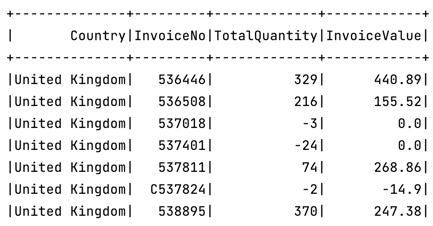

# Module 6:  Aggregations in Apache Spark

Aggregations can be classified into three broad categories:

### 1. Simple Aggregations
### 2. Grouping Aggregations
### 3. Windowing Aggregations

All aggregations in Spark are implemented via built-in functions.
So if you look at the Spark documentation for built-in functions, you will see many functions listed under the aggregate functions.


I will be using the invoices.csv data file.


Now let's go to the application code.

I am reading the data file to a DataFrame.
I am also importing all functions here because aggregation is all about using aggregate and windowing functions.

```
invoice_df = spark.read \
        .format("csv") \
        .option("header", "true") \
        .option("inferSchema", "true") \
        .load("data/invoices.csv")
```

 I also importing:

```
from pyspark.sql import functions as f
```

Now we are ready to do some aggregation.
Let's start with the simplest one.The simplest form of aggregation is to summarize the complete Data Frame,
and it is going to give you a single row in the result.

```
 invoice_df.select(f.count("*").alias("Count *"),
                      f.sum("Quantity").alias("TotalQuantity"),
                      f.avg("UnitPrice").alias("AvgPrice"),
                      f.countDistinct("InvoiceNo").alias("CountDistinct")
                      ).show()
```
The result:


So you can use them in column object expression like we are using here.

And you can also use them in SQL like string expressions.

```
    invoice_df.selectExpr(
        "count(1) as `count 1`",
        "count(StockCode) as `count field`",
        "sum(Quantity) as TotalQuantity",
        "avg(UnitPrice) as AvgPrice"
    ).show()
```

### 2. Grouping Aggregations

Let's try to get this result:


You can use your DataFrame to create a temp view.

And then, you can use the Spark SQL.

```
invoice_df.createOrReplaceTempView("sales")
    summary_sql = spark.sql("""
          SELECT Country, InvoiceNo,
                sum(Quantity) as TotalQuantity,
                round(sum(Quantity*UnitPrice),2) as InvoiceValue
          FROM sales
          GROUP BY Country, InvoiceNo""")
```

It works!



You can do the same using Dataframe expressions also.

```
    summary_df = invoice_df \
        .groupBy("Country", "InvoiceNo") \
        .agg(f.sum("Quantity").alias("TotalQuantity"),
             f.round(f.sum(f.expr("Quantity * UnitPrice")), 2).alias("InvoiceValue"),
             f.expr("round(sum(Quantity * UnitPrice),2) as InvoiceValueExpr")
             )
```
***Please note the last two lines of code, both of them do the same, they both use expr()***

### 3. Windowing Aggregations

#### 1. Identify your partitioning columns
#### 2. Indentify your ordering requirement.
#### 3. Define your window start and end.

Let's go to the WindowingDemo application:

So, I am loading the parquet data to a data frame.
```
 summary_df = spark.read.parquet("data/summary.parquet")
```

Now, we are ready to aggregate the data frame and compute the running total.

Let's define first our Window. We have three things to define here.

***Partition***

***Ordering***

***And the window start/end.***

```
running_total_window = Window.partitionBy("Country") \
        .orderBy("WeekNumber") \
        .rowsBetween(Window.unboundedPreceding, Window.currentRow)
```
That's all. We have now the window definition.

Now computing aggregate over this window is straight.
We start with the Dataframe and use the withColumn() to add a new column for running total.
And the value of the running total is the sum(InvoiceValue)
over the runningTotalWindow.
That's all.

```
summary_df.withColumn("RunningTotal",
                          f.sum("InvoiceValue").over(running_total_window)) \
        .show()
```
n