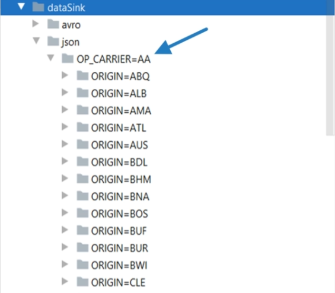
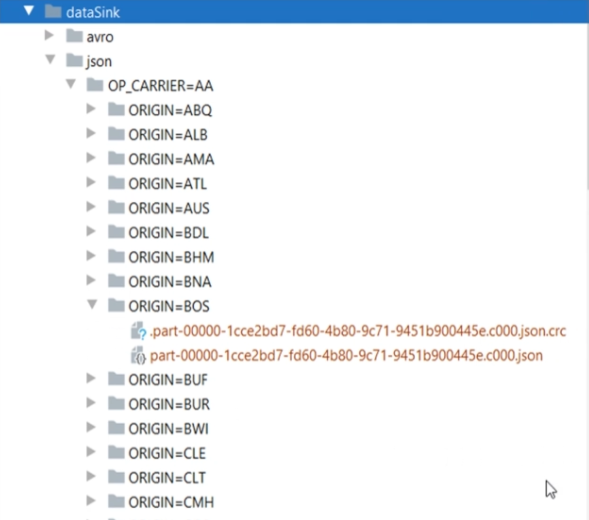

# Module 4: Spark Data Sources and Sinks

## Spark Data Sources and Sinks.

Any processing engine, including Spark, must-read data from some data source. And that's what we mean by Spark Data Sources.

These data sources can be further categorized into two groups.

* External Data Sources
* Internal Data Sources


### External Data sources
Your data might be stored in some source systems such as Oracle or SQL Server Databases.

It might be stored at some application servers, such as your application logs.

However, all these systems are external to your Data Lake. You don't see them in this Data Lake conceptual diagram.

You cannot process the data from these systems unless you read them

and create a Spark DataFrame or a Dataset.

There are two approaches.

The **first approach** is to bring your data to the Data Lake and store them in your Lake's distributed storage. How you bring it to the lake is your choice.
The most commonly used approach is to use a suitable data **integration tool.**

The **second approach** is to use Spark Data Source API to directly connect with these external systems.
And Spark allows you to do it for a variety of source systems.

I prefer the first one for all my batch processing requirements
and the second one for all my stream processing requirements. Bringing data correctly and efficiently to your lake is a complex goal in itself.
We want to decouple the ingestion from the processing to improve manageability.
Your source system would have been designed for some specific purpose.
And the capacity of your source system would have been planned accordingly.

Now, if you want to connect your Spark workload to these systems, then you must have to replan your source system capacity
and the security aspects of those systems.We want to use the right tool for the right purpose.

A spark is an excellent tool for data processing. However, It wasn't designed to handle the complexities of Data Ingestion.

### Internal Data sources

So your internal data source is your distributed storage. It could be HDFS or cloud-based storage.

However, at the end of the day, your data is stored in these systems as a data file. The mechanics of reading data from HDFS or from cloud storage is the same. The difference lies in the data file format.


### Data Sink

The data sinks are the final destination of the processed data.

So you are going to load the data from an internal or an external source.

Then you will be handling it using the Spark APIs.

Once your processing is complete, you want to save the outcome to an internal or an external system.
And these systems could be a data file in your data lake storage, or it could be an external system such as a JDBC database,
or a NoSQL database.

Spark also allows you to directly write the data to a bunch of external sources such as JDBC databases,
Cassandra, and MongoDB.

However, we again do not recommend directly writing data to the external systems
for the same reasons as we do not directly read from these external systems.


## Spark DataFrameReader API.


The third most important thing is the Read Mode.

You can specify the Mode via the option method itself. Reading data from a source file,

especially the semi-structured data sources such as CSV, JSON, and XML, may encounter a corrupt or malformed record.

Read modes specify what will happen when Spark comes across a malformed record. Spark allows three read modes.
permissive dropMalformed and failFast

The **permissive Mode** is the default option.
This Mode sets all the fields to null when it encounters a corrupted record
and places the corrupted records in a string column called _corrupt_record.

The **dropMalformed** is going to remove the malformed record.
That means, you are ignoring the malformed records and only loading the well-formed records.

Finally, the **fail-fast** raises an exception and terminates immediately upon encountering a malformed record.

The last thing is the **schema.**

The schema is optional for two reasons.
DataFrameReader allows you to infer the schema in many cases.
So, if you are inferring the schema, then you may not provide an explicit schema.

Some data sources such as **Parquet** and **AVRO** comes with a **well-defined schema** inside the data source itself.
So, in those cases, you do not need to specify a schema. Once you are done setting the format, all necessary options, Mode,
and schema, you can call the load() method to read the data and create a DataFrame.

However, like any other tool, DataFrameReader also comes with some shortcuts and variations.
We have already seen one such shortcut in the earlier examples.

Instead of using the load method, we used the CSV() method.


That was a shortcut. However, I recommend avoiding shortcuts and follow the standard style.

Following the standard is going to add to your code maintainability.


## Reading CSV, JSON and Parquet files.

Reading CSV, JSON and Parquet files:

```

 flightTimeCsvDF = spark.read \
        .format("csv") \
        .option("header", "true") \
        .schema(flightSchemaStruct) \
        .option("mode", "FAILFAST") \
        .option("dateFormat", "M/d/y") \
        .load("data/flight*.csv")

    flightTimeCsvDF.show(5)
    logger.info("CSV Schema:" + flightTimeCsvDF.schema.simpleString())

    flightTimeJsonDF = spark.read \
        .format("json") \
        .schema(flightSchemaDDL) \
        .option("dateFormat", "M/d/y") \
        .load("data/flight*.json")

    flightTimeJsonDF.show(5)
    logger.info("JSON Schema:" + flightTimeJsonDF.schema.simpleString())

    flightTimeParquetDF = spark.read \
        .format("parquet") \
        .load("data/flight*.parquet")

    flightTimeParquetDF.show(5)
    logger.info("Parquet Schema:" + flightTimeParquetDF.schema.simpleString())
```
## Creating Spark DataFrame Schema.


### Defining a schema

DataFrame schema is all about setting the column name and appropriate data types.

Spark allows you to define Schema in two ways.

Programmatically and Using DDL String

### Programmatically
```
flightSchemaStruct = StructType([
        StructField("FL_DATE", DateType()),
        StructField("OP_CARRIER", StringType()),
        StructField("OP_CARRIER_FL_NUM", IntegerType()),
        StructField("ORIGIN", StringType()),
        StructField("ORIGIN_CITY_NAME", StringType()),
        StructField("DEST", StringType()),
        StructField("DEST_CITY_NAME", StringType()),
        StructField("CRS_DEP_TIME", IntegerType()),
        StructField("DEP_TIME", IntegerType()),
        StructField("WHEELS_ON", IntegerType()),
        StructField("TAXI_IN", IntegerType()),
        StructField("CRS_ARR_TIME", IntegerType()),
        StructField("ARR_TIME", IntegerType()),
        StructField("CANCELLED", IntegerType()),
        StructField("DISTANCE", IntegerType())
    ])
```
### Using DDL String

```
    flightSchemaDDL = """FL_DATE DATE, OP_CARRIER STRING, OP_CARRIER_FL_NUM INT, ORIGIN STRING, 
          ORIGIN_CITY_NAME STRING, DEST STRING, DEST_CITY_NAME STRING, CRS_DEP_TIME INT, DEP_TIME INT, 
          WHEELS_ON INT, TAXI_IN INT, CRS_ARR_TIME INT, ARR_TIME INT, CANCELLED INT, DISTANCE INT"""
```

And you set the previous defined schema using ***.schema(schema name)*** as shown below:
```
flightTimeCsvDF = spark.read \
        .format("csv") \
        .option("header", "true") \
        .schema(flightSchemaStruct) \
        .option("mode", "FAILFAST") \
        .option("dateFormat", "M/d/y") \
        .load("data/flight*.csv")

    flightTimeCsvDF.show(5)
    logger.info("CSV Schema:" + flightTimeCsvDF.schema.simpleString())

    flightTimeJsonDF = spark.read \
        .format("json") \
        .schema(flightSchemaDDL) \
        .option("dateFormat", "M/d/y") \
        .load("data/flight*.json")

    flightTimeJsonDF.show(5)
    logger.info("JSON Schema:" + flightTimeJsonDF.schema.simpleString())

    flightTimeParquetDF = spark.read \
        .format("parquet") \
        .load("data/flight*.parquet")
gfgh
    flightTimeParquetDF.show(5)
    logger.info("Parquet Schema:" + flightTimeParquetDF.schema.simpleString())
```

## Spark DataFrameWriter API.
The DataFrameWriter is a standardized API to work with a variety of internal and external data sources.

Here is the general structure of the DataFrameWriter API.


## Writing Your Data and Managing  Layout.

 I am going to create one example and help you understand the mechanics of using DataFrameWriter.

I created this new example project named DataSinkDemo.

However, we are going to create Avro output in this example. Spark AVRO doesn't come bundled with Apache Spark,
so if you want to work with Avro data, then you must include an additional Scala package in your project.


Remember the spark-defaults.conf file. Let me open.

We used this file to configure some Java System variables.
```
spark.jars.packages                org.apache.spark:spark-avro_2.12:3.3.0
```
And that's all.

I have this parquet data file below, which I am going to use as a data source and we will be creating an Avro file after processing the source data.


I have also created this DataSinkDemo.py file.

I have the main() method, which creates a SparkSession and reads the data source.


So let's write this DataFrame as an Avro output.

We start with the DataFrame and use the write() method to get the DataFrameWriter.

Then we set the format. And then the save mode. I am going to use the overwrite mode.
The next most important thing is to set the output directory path.
Finally, we call the save() method.


How many Avro files do you expect?
One, two, or ten?.
It depends upon the number of DataFrame partitions. So, if this DataFrame has got five partitions,
you can expect five output files,
and each of those files will be written in parallel by five executers.

If you have three executors and five partitions,
then they are going to share the five partitions among three executors.


But how many partitions do I have?

Let me check the number of partitions.
```
logger.info("Num Partitions before: " + str(flightTimeParquetDF.rdd.getNumPartitions()))
```
We convert the DataFrame to an RDD and get the number.

After run it, it shows 2 partitions:


Here is my output directory:


You can see three types of files here.

The AVRO file is the data file. You also have this CRC file, which holds the data file checksum.
And the SUCCESS file indicates that the write operation was successful.

I got two partitions.

However, I have only one AVRO file. So what went wrong? 

I was expecting two Avro files because I have two partitions here. Right?

We counted the number of partitions but we do not know how many records do we have in each partition.

Let me count the number of rows for the partitions.

Here is the code.
```
flightTimeParquetDF.groupBy(spark_partition_id()).count().show()
```

Let's see:


So, the partition-id zero has got all the records,
and we do not see any other partition-id here.
We do have two partitions,
but it doesn't show up because the second partition has got nothing.
And that is why I got only one output file.

Now let's repartition it and see if we get multiple files.

Let me force it to make five partitions. And this time, I am going to write the partitioned DataFrame.

```
partitionedDF = flightTimeParquetDF.repartition(5)
logger.info("Num Partitions after: " + str(partitionedDF.rdd.getNumPartitions()))
partitionedDF.groupBy(spark_partition_id()).count().show()

partitionedDF.write \
        .format("avro") \
        .mode("overwrite") \
        .option("path", "dataSink/avro/") \
        .save()

```

Let's run it. So now you can see that the repartition worked and I got five equal partitions.
And I also got five output files.


We do want to partition our data because we will be working with massive volumes.
And partitioning our data might get us two types of direct benefits. Parallel Processing
and Partition Elimination for certain read operations.

So, you might want to partition your data for specific columns.

And that is where you can use the partitionBy() method.

Let's do it.

This time I want to use the JSON format.

We still use the overwrite mode.

```
    flightTimeParquetDF.write \
        .format("json") \
        .mode("overwrite") \
        .option("path", "dataSink/json/") \
        .partitionBy("OP_CARRIER", "ORIGIN") \
        .save()
```
The first column is the flight carrier, and the second column is the flight origin.

The DataFrameWriter will partition this DataFrame using these two columns.

What does it mean?

Let me execute it, and then I will explain.


Let's look at the output directory.My dataset has ten different flight carriers. And I got one directory for each carrier.


Now, if you are reading this dataset and want to filter it only for one carrier such as HP.

Then your Spark SQL engine can optimize this read and filter operation, ignoring other directories and only reading the HP directory.

Now let's go inside one of these directories.:




So we have a second level of directories.

And this is caused by the second column in the partitionBy() method.

So, The carrier AA has got these many origins.

And each origin becomes a subdirectory.





If you go inside these directories, then you will see the data file.
Your data is partitioned by the unique combination of your partition columns.
And these partitions are written down in a separate directory.
Each data file in these directories will hold data only for the given combination.

But how can you control the file size here? ***maxRecordsPerFile.***

I am going to limit the file for 10K records only.

```
    flightTimeParquetDF.write \
        .format("json") \
        .mode("overwrite") \
        .option("path", "dataSink/json/") \
        .partitionBy("OP_CARRIER", "ORIGIN") \
        .option("maxRecordsPerFile", 10000) \
        .save()
```

## Spark Databases and Tables.

Apache Spark is not only a set of APIs and a processing engine.

It is a database in itself. So you can create a database in Spark.
Once you have a database, you can create database tables and views.


The table has got two parts. Table Data and Table Metadata. The metadata is stored in a meta-store called catalog.
The meta-store holds the information about the table and its data,
such as schema, table name, database name, column names, partitions, the physical location where the actual data resides.
All of this is stored in a central meta-store called catalog.
By default, Spark comes with an in-memory catalog which is maintained per spark session.

Spark allows you to create two types of tables:


### Managed Tables
For managed tables, Spark manages both: the metadata and the data.If you create a managed table, then the Spark is going to do two things.
Create and store metadata about the table in the meta-store. Then Spark is going to write the data inside a predefined directory location.
This directory is known as the ***spark.sql.warehouse.dir.***
So the ***spark.sql.warehouse.dir*** is the base location where all your managed tables are stored.
And your cluster admin is going to set this base directory location for you.


### Unmanaged Tables (External Tables)

When you create an unmanaged table, then you must specify the data directory location for your table.
Unmanaged tables are to give you the flexibility to store your data at your preferred location.


You already have some data. It is stored at some directory location.
And you want to use Spark SQL statements on this dataset, such as select count(*) from ...whatever.
However, Spark SQL Engine doesn't know anything about this data.
So, you can create an unmanaged table and map the same data to a Spark Table. Now, Spark will create metadata and store it.
This will allow you to run your Spark SQL statements on this data.

As a side effect, if you drop your managed table, Spark is going to delete the metadata and the data as well.
If you drop an unmanaged table, then Spark is going to remove the metadata and do not touch the data files.

The unmanaged tables are designed for temporarily mapping your existing data and using it in Spark SQL.
Once you are done using it, drop them, and only metadata goes off, leaving your data files untouched.

We prefer using managed tables because they offer some additional features such as bucketing and sorting.

All the future improvements in Spark SQL will also target managed tables.

Unmanaged tables are external tables, and Spark does not have enough control over them.
They are designed for reusing the existing data in Spark SQL,
and it should be used in those scenarios only.


## Working with Spark SQL Tables.

I have created the SparkSQLTableDemo example.

Most of the things are the same as the earlier example. We are going to create a managed table in the apache spark.
Creating managed tables is going to need persistent Metastore. We already learned that the Spark depends on HIve Metastore.
So, we need spark-hive for this example.


We want to use the Hive Metastore, so I am going to enable hive support. ***.enableHiveSupport()***
This is needed to allow the connectivity to a persistent Hive Metastore.

```
if __name__ == "__main__":
    spark = SparkSession \
        .builder \
        .master("local[3]") \
        .appName("SparkSQLTableDemo") \
        .enableHiveSupport() \
        .getOrCreate()

    logger = Log4j(spark)

    flightTimeParquetDF = spark.read \
        .format("parquet") \
        .load("dataSource/")
```

Why do I want to save my DataFrame as a Managed Table?
Why not as a parquet file?

You can save your processed data to a data file such as Parquet or Avro.
However, if you want to reaccess it, then you must use the DataFrame Reader API and read it as a DataFrame.


However, Spark is a database also. So if you create a managed table in a Spark database,
then your data is available to a whole lot of other SQL compliant tools.

Spark database tables can be accessed using SQL expressions over JDBC/ODBC connectors.

So, you can use other third-party tools such as Tableau, Talend, PowerBI,
and a whole bunch of other tools. However, plain data files such as Parquet, Avro, JSON, CSV, etc.
are not accessible through JDBC/ODBC interface.


Writing a DataFrame is as simple as using the DataFrame.write() method.
Set the save mode. And finally, saveAsTable().

The saveAsTable() method takes the table name, and it creates a managed table in the current spark database.

But what is the current Spark Database? Apache Spark comes with one default database.
The database name itself is the default. So, the SaveAsTable() is going to create my flight_data_tbl in the default database.
However, I wanted to create this table in the AIRLINE_DB.

You have two options:

* Prefix the database name with your table name.
* The second option is to access the catalog and set the current database for this session.

I am assuming that the AIRLINE_DB already exists. But to be on the safer side, let me create it here. The catalog gives you access to the whole bunch of metadata information.

Let me use it to get a list of all the tables in my AIRLINE_DB.

```
if __name__ == "__main__":
    spark = SparkSession \
        .builder \
        .master("local[3]") \
        .appName("SparkSQLTableDemo") \
        .enableHiveSupport() \
        .getOrCreate()

    logger = Log4j(spark)

    flightTimeParquetDF = spark.read \
        .format("parquet") \
        .load("dataSource/")

    spark.sql("CREATE DATABASE IF NOT EXISTS AIRLINE_DB")
    spark.catalog.setCurrentDatabase("AIRLINE_DB")

    flightTimeParquetDF.write \
        .mode("overwrite") \
        .saveAsTable("flight_data_tbl")

    logger.info(spark.catalog.listTables("AIRLINE_DB"))
```

You can see the catalog information here.

It shows you the table name, database name, and the table type as well.


Two directories are created after the code above is executed:


If you look inside, you will see a base directory for your database.

Then you will see another subdirectory for the table.

And inside your table, you have your data file.


So I created a Spark SQL table. However, I wanted to create a partitioned table.

So let me add a partitionBy() method.

```
   flightTimeParquetDF.write \
        .mode("overwrite") \
        .partitionBy("ORIGIN","OP_CARRIER")
        .saveAsTable("flight_data_tbl")

```
After re-run it I have overwritten this plain table with a partitioned table.
However, I got these 200+ partitions.


And this happens because I have 200+ different origins. However, what if I had 100K unique values for my partition column.

Do you want to create 100K partitions? Absolutely not. Right?

So, you should not be partitioning your data for a column that has got too many unique values.

Instead, you can use the bucketBy().

I am changing the format to CSV. Parquet is a binary format, and it is the recommended format.
However, I want to manually investigate the data, so I am changing it to CSV.

```
   flightTimeParquetDF.write \
        .format("csv")
        .mode("overwrite") \
        .bucketBy(5,"ORIGIN","OP_CARRIER") \ 
        .saveAsTable("flight_data_tbl")

```

After run it:

These are my five partitions or buckets, whatever you call it.

The bucketing does not require a lengthy directory structure.

It is as simple as data files.


I asked to create five buckets. So Spark created five files. Each file is one bucket.

Now Spark will read one record, look at the key column values. In my case, it is the OP_CARRIER+ORIGIN.

Now compute the hash value. Let's say you got some hash number.
Divide it by five and take the remainder.
You are going to get something between 0 to 4. Right?
If the remainder is 0, place the record in the first file.
If you got 1, put it in the second file and so on.


So you now understand the bucketing.

As an end result, each unique key combination is going to produce the same hash value,
and hence it is going to land in the same file.
