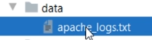

# Module 5: Spark Dataframe and Dataset Transformations


So, In Spark, we read the data and create one of the two things.

DataFrames and Database Tables

Both of these are the same but two different interfaces. The DataFrame is the programmatic interface for your data,
and the database table is the SQL interface of your data. Now when we talk about the transformations, we again have two approaches.
A programmatic approach that we apply on DataFrames. SQL expressions that we can use on the Database Tables.

However, we need to learn the programmatic approach for doing similar things, which you can easily do using the SQL expressions
And then we can take it to the next level where you have more flexibility in your hand to go beyond the straightforward SQL expressions.


What do we mean by transformations?

Here is the list to answer this question.

* Combining one or more DataFrames using operations such as Join and Union

* Aggregating and summarizing your DataFrames using operations such as grouping, windowing, and rollups

* Applying functions and built-in transformations on your DataFrame
such as filtering, sorting, splitting, sampling, and finding unique.

* Using and implementing built-in functions, column-level functions, and user-defined functions

* Referencing Rows/Columns and creating custom expressions

With these capabilities in your hand, you should be able to cover most of your transformation requirements.


## Working with Data Frame Row

Data transformation is all about playing with your DataFrame rows and columns.

However, working with a row and column is not that straightforward.


Spark DataFrame is a Dataset[Row].

Right?

And each row in a DataFrame is a single record represented by an object of type Row.

Most of the time, you do not directly work with the entire row.

However, we have three specific scenarios when you might have to work with the Row object.


### 1. Manually creating Rows and DataFrame.
### 2. Collecting DataFrame rows to the driver.
### 3. Work with an individual row in Spark Transformations.

The first two scenarios are mostly used in unit testing or during development. Let's take a look using Databricks:

Login to your DataBricks Cloud account and create a new cluster.

Give a name to your cluster,

select your Spark Version, and create it.


Now you need a notebook.

Let me create a new notebook.

Give a name to your notebook.

Select your preferred language and create it.

Now I am ready to write some code and run it from here.

Let's assume I am a spark developer, and I created a function. This function takes a DataFrame, date format string, and a field name.
Then it simply returns a new DataFrame converting the type of the field using a given date format.


So, let's assume that the input and output of DataFrame is something like this.

The data type of the EventDate is a string,
which is converted to a DateType in the output DataFrame.


Let me import some necessary packages.


I need a DataFrame so I can pass it here and test it. We are going to create a DataFrame on the fly.

A DataFrame requires a schema.
Then I create a List of Row Objects. This list is not distributed. It is a single list with four records.
So, I am going to convert it to an RDD of two parallel partitions.
Now, you can use this RDD and the Schema to create a DataFrame.


Now I can test my function.

Let me print the before status.

Then I am going to call my function.

Finally,y I will print the after state.


So My before DataFrame shows a String filed.

And the after DataFrame shows a DataType filed.


## Dataframe Rows and Unstructured data

Spark DataFrame offers a bunch of Transformations functions.
You will be using these methods when your DataFrame has got a schema.

What if you do not have a proper schema?

When your DataFrame doesn't have a column structure, you will take an extra step to create a columnar structure.
And then use your transformation functions. In those cases, you may have to start working with the row only and then transform it into a columnar structure.


Let's create an example to help you grab the idea.

I created this LogFileDemo example.


And I have this unstructured data file.



The data file is an apache web server log file. Each line in this file is one log entry.
We do have some patterns in the log output. However, this file is not even a semi-structured data file. It is just a log dump.
So if you read this file in a DataFrame, all you are going to get is a Row of strings.
You cannot have columns because the data file is an unstructured data file. How to deal with these scenarios?


We are going to parse this data file and extract some fields.

Same as earlier, I created this main entry point and also created the SparkSession.

```
if __name__ == "__main__":
    spark = SparkSession \
        .builder \
        .master("local[3]") \
        .appName("LogFileDemo") \
        .getOrCreate()
```

Now I am going to create a DataFrame and read the text file.

The text file gives me a DataFrame[String].

Let's print the schema and see what do we get.

```
    file_df = spark.read.text("data/apache_logs.txt")
    file_df.printSchema()
```
So, I have a DataFrame. And the DataFrame Row has got only one string field named value.
That's all. No other columns and schema. I cannot use many of the higher level transformations such as aggregation and grouping.


We need to find a way to extract some well-defined fields from the data.
We might need to use  some regular expressions here.


Every entry in this log follows a standard apache log file format.


It comes with the following information:


We can extract all these fields using a regular expression.

```
log_reg = r'^(\S+) (\S+) (\S+) \[([\w:/]+\s[+\-]\d{4})\] "(\S+) (\S+) (\S+)" (\d{3}) (\S+) "(\S+)" "([^"]*)'
```
This regex is going to match against eleven elements in a given string.

And I will be using this regex to extract the fields.


We start with the DataFrame and use the select() method.


I am going to use the regexp_extract() function.
This function takes three arguments.
The first argument is the field name or the source string.

The second argument is the regular expression.
So this regular expression will extract all eleven fields. But I am only interested in some of them.

Let's take the first field, which is an IP address.

Then we take the fourth one, which is date-time.

Then we take the request and finally the referrer. That's all.

```
    logs_df = file_df.select(regexp_extract('value', log_reg, 1).alias('ip'),
                             regexp_extract('value', log_reg, 4).alias('date'),
                             regexp_extract('value', log_reg, 6).alias('request'),
                             regexp_extract('value', log_reg, 10).alias('referrer'))
```

Let's print the schema
```
 logs_df.printSchema()
```
Great! So we got four fields. That's what we wanted!.


My initial DataFrame had a single string field but no schema. Now I got a new DataFrame with four fields.

Now it is quite simple to perform some kind of analysis on this data frame.

## Data Frame Columns

We will learn some foundational things to work with the Columns.

Working with DataFrame requires you to have clear answers to the following questions.


So, log in to your DataBricks community cloud and create a new cluster.
Create a new Notebook.
Give a name to your notebook, select a language, and create it.

DataBricks community cloud comes with some public data sets.


I am going to use the airline's data. Well, the data set is huge, and my community cluster is not capable of handling such volumes.
So, I am going to use just one file out of all these.


Let's see the data:

It is a CSV format data, and it comes with a header row.

I can quickly load it and infer schema to create my DataFrame.


Let's do it.

Here is the code.


So we now have a DataFrame to explore and learn the column expressions.

Spark DataFrame columns are objects of type Column. Columns are always used within a Spark Transformation.

There are two ways to refer to columns in a DataFrame Transformation.

* Column String
* Column Object

Column String is the simplest method to access a column.

Here is an example. In this example, I am using a column name string.
Spark offers a bunch of DataFrame transformations that are designed to accept column strings.
You have already seen the select() method.
You can use column strings with the drop(), orderBy(), groupBy(), cube(), rollup() and few more.


The second option is to access your columns using the column object.

And this one is a bit confusing because you have a bunch of ways to create column objects.

However, the most common method is to use the column() or the col() function.

Here is an example.

So, I used three different methods to reference a column.
All of these methods are the same. They all are creating a column object.
The ***first one*** is using the column() function, and ***the second one*** is using the shorthand of the same, i.e., the col() function.

***The third method*** is also the same and all of the three methods shown here have the same meaning and the same effect.


You can even use Column String and Column Object in the same transformation.


### How to create column expressions?

Spark DataFrame offers multiple ways to create column expressions.

You can group them into two types.

* String Expressions or SQL Expressions.
* Column Object Expressions


Let's assume I have this select expression.
I am selecting three columns here, and I am using Column String.
I want to add one more column for the flight date. I want to combine these three fields and create a single field for the date of the flight.


If you know SQL, you can easily create an expression like this.

However, this is an expression string and not a plain column name string.


Try running it, and you will get an error. Because the select method accepts column strings or column objects.

They do not take expressions!!.


You can use the ***expr()*** function to convert an expression to a column object.

Now, this ***expr()*** function is going to parse the expression and return a column object.


The second method is to use column objects and build your expression.
The only difference is to avoid using strings and apply column objects and functions.

The first three columns are already using object notation. The problem is the last one.


Let's fix it.

I am going to remove this expr() function.

Now I am going to do something that the expr() function was doing.

Remove these double-quotes.

We have a to_date(), and the concat() functions that we can directly use.

However, these functions do not understand the column names.

They take name strings.

So, let me place a double quotes.


So, we are now good with the concat() and the to_date() functions.

The concat() function is going to combine these three columns and return a new column.
the new column goes to the to_date() function which returns a Date column.

Now you can apply the alias() function to rename it.


Most of the Spark transformations are designed to accept both the forms.

Look at the filter function for dataframes. It accepts column expressions and SQL expressions:

* Column expressions


* SQL expressions


```

```
