# Module 2: Spark Programming Model

## Creating Spark Project Build Configuration

In this section, we are going to create and run our first Spark program. We will create a Spark Project and define our project Build Configuration.

I will be using PyCharm as my development IDE. So I am assuming that you already have PyCharm.  

You will also need Python, and I recommend you to get Anaconda Python installed on your machine. These two items are the prerequisite of Spark Programming using the IDE.You should also download Spark binaries and set your SPARK_HOME environment variable.


So let's start the PyCharm IDE.

We are going to create a new project.

Give a name to your project.

And chose your Python interpreter and the Virtual environment.

We are going to use a conda environment, so make sure you selected conda in this box.

We will use Python 3.9.

The next box has already picked up the conda file location.

Let's create the project. Wait for a few minutes while conda configures a virtual environment for you.


But before you do anything, let's install some necessary packages.

Go to Pycharm->Preference and look for your project name.

Select the interpreter. Make sure you are using a conda package manager. So, these are the default packages that are already included in your project. However, this is not enough. We need PySpark also.


Let's add pyspak by using the search bar and then click on Install package at the botton left corner.


Let's add pytest for unit testing.


Now, let's create the main program.

Right-click on your project, go to new, and create a Python File, give it a name.


Let's import the below. You need this line in every Spark program.

From pyspark.sql, import everything.

And, let's create the main entry point of my PySpark program.

I am going to print a Hello message and run it once.


## Configuring Spark Project Application Logs

We already created a basic Spark project and also added dependencies. However, a proper application must have some kind of application logging.
So, we are going to configure the Spark application log. Spark project make use of Log4J, and we also want to use the same for our Spark applications.


So, let me open my Spark project and add a Log4J properties file. I already have a preconfigured log4j.properties file. Let me add it to the project root directory.

Let's look at the file content. The content of this file is pretty much standard. Let me quickly explain a few things. The Log4J works almost the same way as Python logs.

In the most basic setup, the Log4J has got three components.

* 1. Logger: The Logger is the set of APIs which we are going to use from our application.
* 2. Configurations: Configurations are defined in the log4j properties file, and they are loaded by the loggers at runtime. 
* 3. Appenders: Appenders are the output destinations, such as Console and a log file.


So, I have defined the root category at the top. For any hierarchy or category, we define two things.

The first thing is the log level, and the second thing is the list of appenders.

Log4J supports multiple log levels, such as DEBUG, INFO, WARN, and ERROR. I am setting the root category as WARN.

So, at the topmost level, we only want to see the warnings and errors. We do not want to see the info and debug messages. And we want these messages to go to the Console. So, I am setting the appender as Console.

The next thing is to define the console appender, which I am doing here. All these configurations are standard, and they remain the same in most of the projects. So, the first  two sections (Logs to console and console appender)together will set the root level log4J configuration and they will stop all the log messages sent by the Spark and other packages except warning and errors.


However, we want to change the behavior of our application. So, I am defining the second log level specific to my application. This level is defined as guru.learningjournal.spark.examples. This is the name that is going to be used when using the Logger in my application.

So, the application level log will be set to INFO. And I want to send these logs to console and file appenders. We want application-level logs to go to the console and log file both.


We already defined the console appender. So, I am setting the file appender here. The rest of the settings below this level are some recommendations by the Spark Log4J configuration template.


## Creating Spark Session

We already learned that every Spark program will start a driver. And then, the driver is going to start the executors for doing most of the work. So, the first thing in a Spark program is to create a SparkSession object, which is your Spark Driver.

Well, it is an overwhelming statement, and one can debate if the Spark Session is the driver or the main() method itself is the driver. However, things are going to make a good sense if you start looking at your Spark Session as your driver.

So, I am going to follow this notion. SparkSession is your driver.

When you start the spark-shell or a notebook, they create a Spark Session for you
and make it available as a variable named spark. However, when you are writing a spark program, then you must create a SparkSession because it is not already provided.

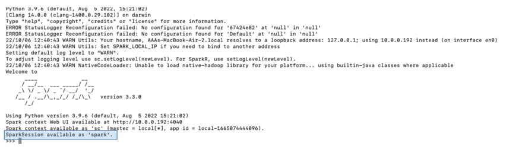

Creating a SparkSession is straightforward.

You will declare a variable and use SparkSession.builder().getOrCreate().

That's all. You got your SparkSession object, and we often name it as the spark. SparkSession is a Singleton object, so each Spark application can have one and only one active spark session. And that makes a perfect sense because the SparkSession is your driver, and you cannot have more than one driver in a spark application.


Spark is a highly configurable system, and hence your SparkSession is also highly configurable. However, I haven't used any configurations yet. Let's add some configs.

The builder method returns a Builder object, which allows you to configure your SparkSession and finally use the getOrCreate().

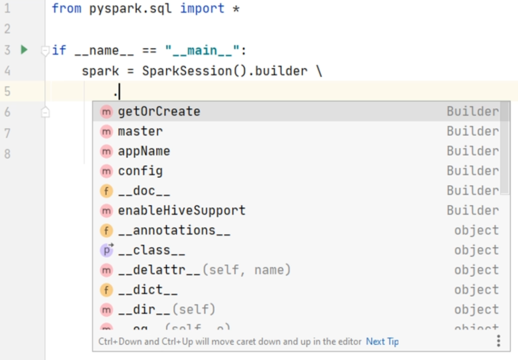


Some configurations, such as AppName, and Master are the most commonly used configs by almost every application. So, we have direct methods to specify them.

However, we also have some overloaded config () methods for all other configurations. Let me define the application name. We also want to set the cluster manager, and we already learn that the cluster manager config is defined as a spark master.


Let's define the application name. We also want to set the cluster manager, and we already learn that the cluster manager config is defined as a spark master.

I am going to use local multithreaded JVM with three threads.

So we created a Spark session, and that means we created our spark driver.

We will be using this driver to do some data processing, and once we are done with it, we should stop the driver. That's how a typical spark program is structured.

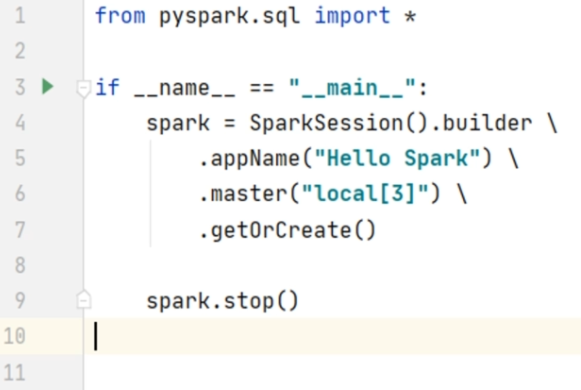


The final code looks like this after including some logs variables:

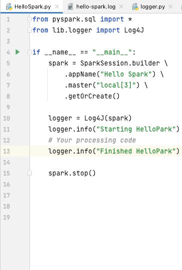

As a reminder:

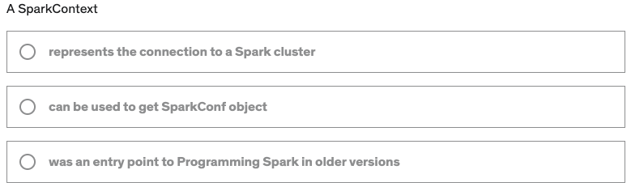

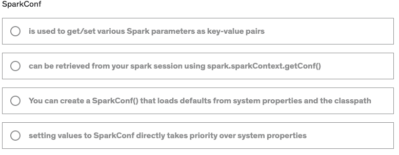

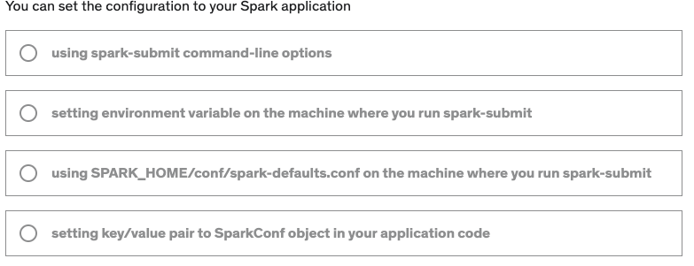

## Configuring Spark Session

Apache Spark is a highly configurable system,and Spark allows you to set those configurations using four different methods.

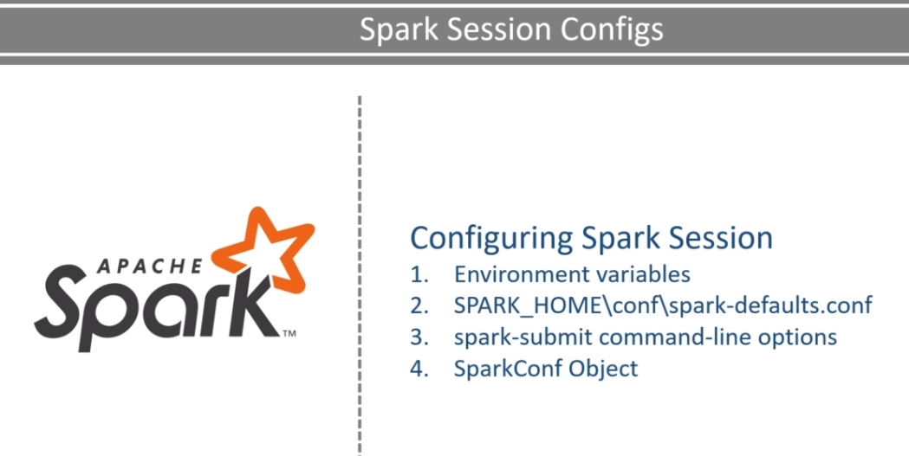

The first approach is to set environment variables that your Spark application will read and infer some information. We have already seen this. We defined SPARK_HOME, HADOOP_HOME, and PYSPARK_PYTHON. Right?

The environment variables are mostly ignored by the developers except few that are required for you to set up your local development environment. As it is mainly used by the cluster admins.

The other place to configure your Spark is the spark-defaults-dot-conf file. We used this one also previously. We used this file to configure some JVM variables such as log4j configuration file, log file location, and name.

However, this file is to set some default configurations for all the applications and used by your cluster admins.

This method of configuring your Spark application is also ignored by developers, and we use this occasionally for our local development environment.

The third and fourth method is for developers. Now let me talk about the spark-submit.

We have already used spark-submit before.

Spark-submit allows you to configure your application using command-line options such as --master. You have already seen that in action.

Similarly, spark-submit can also accept any Spark config using the --conf flag.

Here is an example:

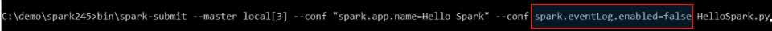

If you have a space in your config, then you must enclose it in double-quotes. Otherwise, the double quote is not necessary.

The fourth and last method is to code the configurations in your application. We used this method also.

I am setting appName() and master().

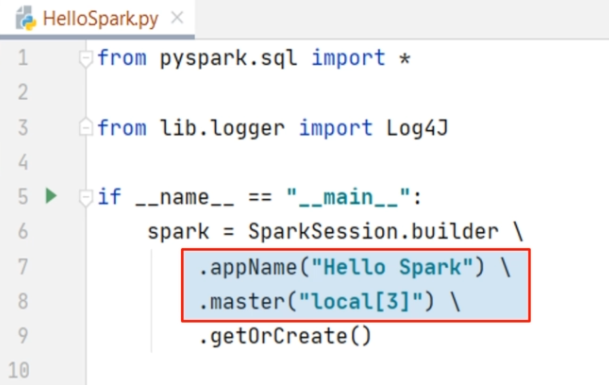

You can set these from the command line using spark-submit, or you can set them from here, in your application code. It's not only appName() and master(). You can set whatever config you want.

Create a SparkConf object. Now, you can use the set() method to set the application name config. You can set as many configs as you want. However, you must know the actual config property name string.

For example, the spark application name config string is "spark.app.name."

Similarly, "spark.master" is the string config name for the spark master.

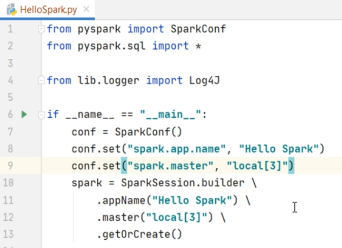

You can refer to the following documentation link for a list of all available spark configs.

https://spark.apache.org/docs/latest/configuration.html#application-properties

Now, you might be wondering which configuration method to use?  What if we set the same config from two places? Which one takes precedence?

When you run your spark application on your local machine, or you submit it to the Spark cluster, in both the cases, your application will read the environment variable, spark-defaults, and the command-line options.

Spark will combine all these configs and create a single set of initial configs which go to your application and sit in your Spark Session. In all this, environment variables are given the lowest precedence, then comes the spark-defaults and finally the command-line options. So, if you have something defined in the spark-defaults and the same config is also set via the command line Spark will overwrite the spark default config with the Spark submit config.

Finally, all these initial configs can be overwritten by you from your application code. So, setting the Spark configurations from your application code gets the *highest precedence*.

Leave the environment variables and spark-defaults for your cluster admins.

Do not make your application dependent on these two methods of setting configurations.

So you should be using either command line or spark conf.

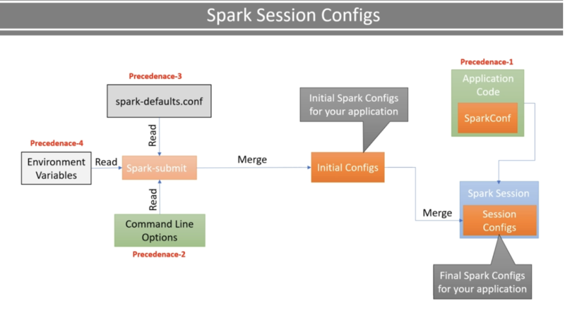

Now let's come back to our application code.

So, we are setting these configurations. However, I still see one problem. All these configurations are hardcoded in my application.

In some cases, you may want to avoid hard-coding specific configs and keep it outside your application code. For example, hardcoding the master is a big problem.

While developing and debugging my application, I want to use the local master. However, once my application is ready, I want to deploy it in a cluster environment. And I don't know yet if I am going to use it on YARN or on a Kubernetes cluster. So, I do not want to hard-code this config.

The first approach is to keep these configurations in a separate file and load it from the file at run-time. I am creating a Python config file named spark.conf.

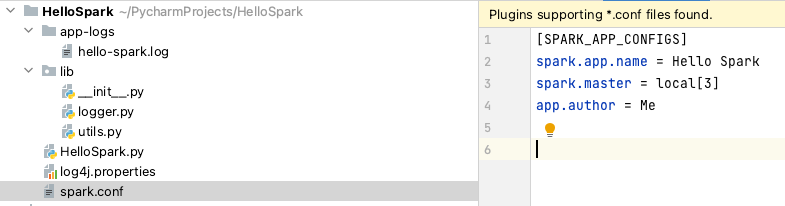

Now come back to your code and create a new python file in the lib package. Name it utils.py.

I am going to create a new function. This function will load the configurations from the Spark.conf file and return a SparkConf object.


We will create a new SparkConf object.

Read the configs from the file.

Loop through the configs and set it to the SparkConf.

Finally, return the SparkConf object.

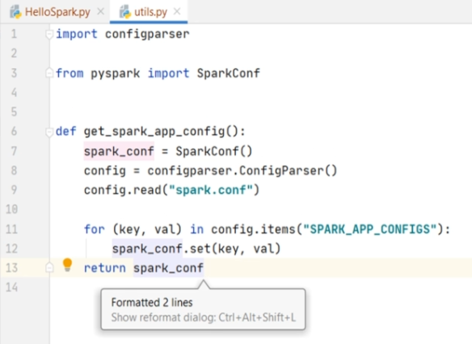


This function reads all the configs from the "Spark.conf" file, set them to the SparkConf object, and return the ready to use SparkConf.

Now, we need to come back to the main and use it in the spark builder.config method.

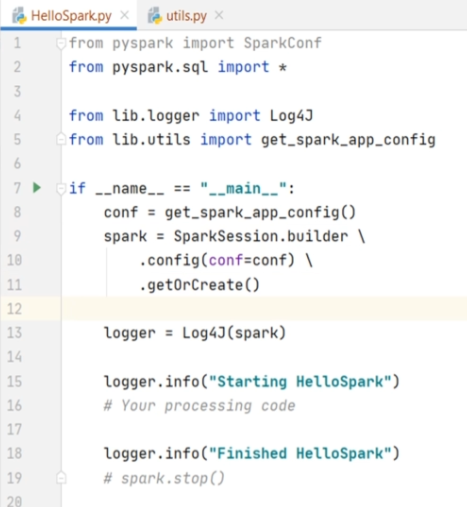

Done. We fixed the hardcoding problem.

Now you can add more and more configs in this spark.conf file, and your application will load it at runtime and use them to configure your SparkSession.


*You can read all your spark configs using the SparkSession.sparkContext.getConf() method. And you can print a debug string.*

Let's run it.
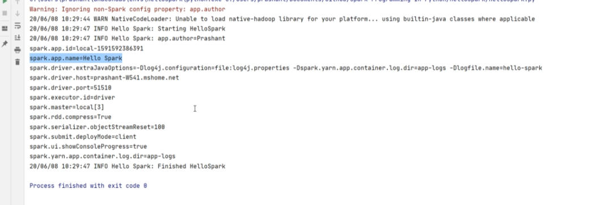

Great! You can see the outcome. We loaded everything from the config file.

## Data Frame Introduction

A typical data processing is a three-step process:

* Read the data.
* Processes it according to your business requirement.
* Write the outcome of your processing.

Let's implement the first step in our Spark application.

Reading the data. I have a data file named sample.csv. It is a small file with less than ten records, and I am going to use it for local development, debugging, and testing.

I am keeping this file in a separate directory named data.

I want to read this file using Spark. So, the first thing that I want to do is to pass the file name and location as a command-line argument to my application so we don't have to hardcode the data file name and location in my application.

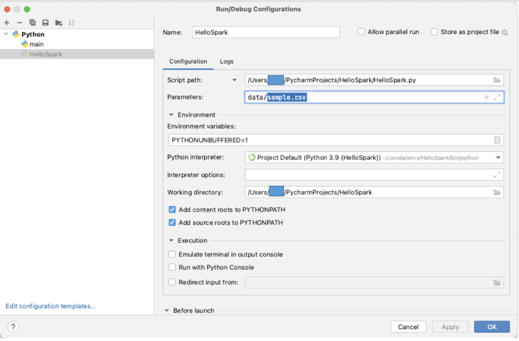


Then we check for the command line argument. If not provided, we log an error and exit the program.

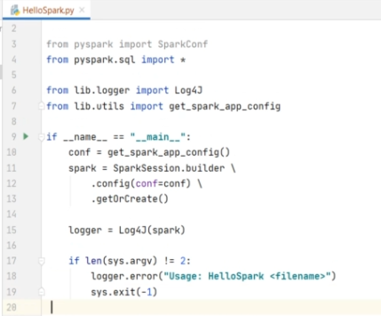

So now, we are ready to read the data file, and the file name is given in the command line argument.

We start with the Spark Session and call the read() method, which returns a DataFrameReader object. The DataFrameReader is your gateway to read the data in Apache Spark. It allows you to read the data from a variety of sources,
and you can see all these functions here:


You can read a CSV, JDBC, JSON, ORC, Parquet, and Text File.

Well, the list doesn't end here, and I will cover it in more detail at a later stage.


However, we want to read a CSV file, so let's use the CSV() method. All you need to do is to pass the file path.

```
survey_df = load_survey_df(spark,sys.argv[1])
```

Spark will load the data into a Spark DataFrame.

CSV data files are plain text data files. And in the sample data the first row is a header row, and the rest of the rows are data rows.


The DataFrameReader doesn't know these details. So, we must tell this information to the DataFrameReader so it can read the file correctly.
You can do it using the DataFrameReader *option()* method.

The option method takes a key-value pair,
and you can get a list of all available CSV options from Spark Documentation.

https://spark.apache.org/docs/latest/api/python/reference/pyspark.sql/api/pyspark.sql.DataFrameReader.html?highlight=dataframereader#pyspark.sql.DataFrameReader


Checkout the CSV method,

and you should get the list of all available options.

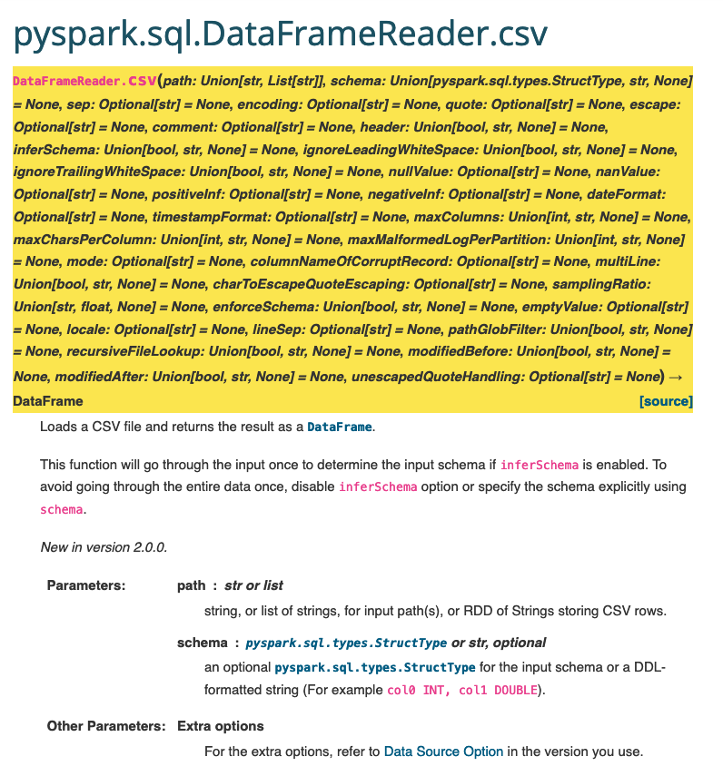

The sample data file comes with a header row, so I want to set the header option to let the dataframe know that the first row contains de columns.
The default value is false, and I am going to set it to true.
```
.option("header", "true")
```

Now the DataFrameReader will skip the first row but use it to infer the column names and create a Spark DataFrame.


But What is a DataFrame?

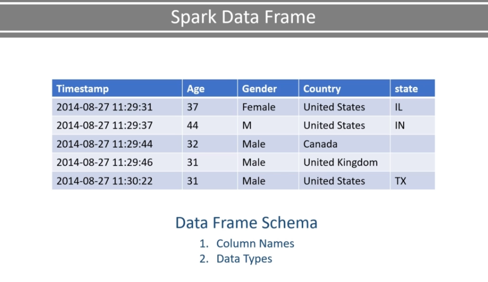

Let me give you a quick introduction to the DataFrame.

Spark DataFrame is a two-dimensional table-like data structure that is inspired by Pandas DataFrame.
They are a distributed table with named columns and well-defined schema.
That means each column has a specific data type such as integer, float, string, timestamp, etc.

You can visualize your DataFrame as a database table.
And most of the operations that you are going to perform on these DataFrames are also similar to database table operation
using rows and columns.

So, if you have already worked with databases and SQL, you are going to feel at home with Spark DataFrames.

So now you know that a DataFrame must have two things.

* Column Names

* Schema - I mean, data types for each column.


Now let's come back to our program.
We are reading a CSV file using a DataFrameReader.
We are also using the header option.
So, the DataFrameReader is going to use the header row and infer the column names.
But what about the schema?
I mean, the data types for the columns.

Let's look at the CSV options.

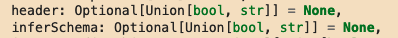

You can use the inferSchema option.
This option will allow the DataFrameReader to read a portion of the file
and make an intelligent guess about the data types for all the columns.

This option works well in some cases, but it fails to infer the correct data types in most of the cases. However, at this stage,
we are good to go with the infer schema option.

So let me add the inferSchema option. This code is going to read a CSV data file,
use the first row to infer the column names, make an intelligent guess for the column data types,
and finally return a DataFrame.

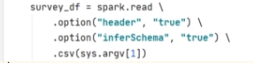


However, I do not want to keep this code in my main() method.
I recommend that you create a function and move this code to the function.
As we are going to reuse this code at least twice, if not more.

So, let me create a function.
I am going to name it as loadSurveyDF.
This function will take two arguments, SparkSession and the file location.
And the function is going to return a DataFrame.

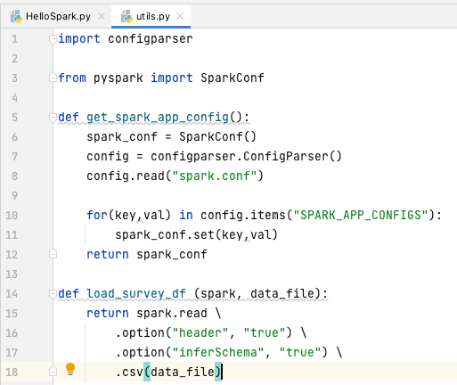


Now you can call this function from your main() method. If you want to quickly run it and verify your code,
use the DataFrame show() method and run it.

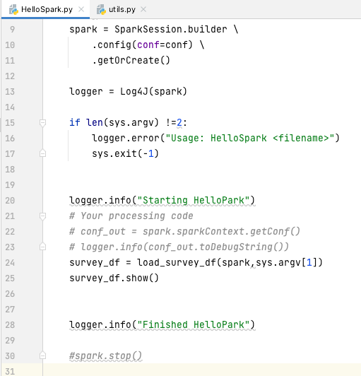


Great!

It worked.

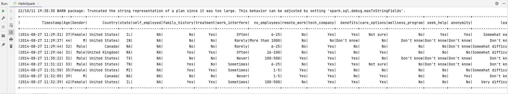


## Data Frame Partitions and Executors
## Spark Transformation and Actions
## Spark Jobs Stages and Task
## Understanding your Execution Plan
## Unit Testing Spark Application